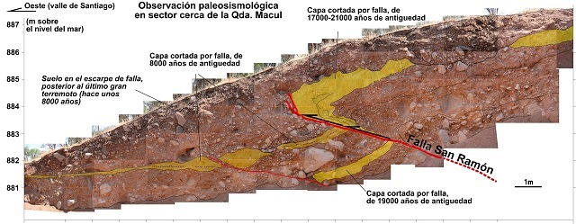
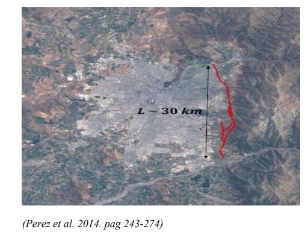
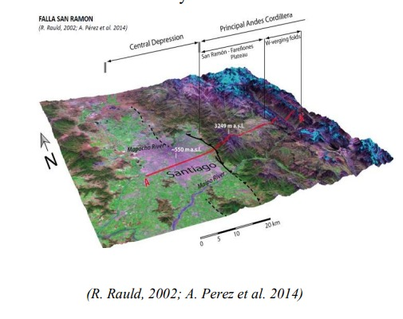

La planificación urbana en Chile ha operado históricamente bajo una lógica de expansión que suele omitir las condicionantes geomorfológicas del territorio. El caso de la Falla de San Ramón (FSR) es, quizás, el exponente más crítico de esta desconexión institucional. No nos enfrentamos a un simple dato estadístico, sino a una estructura geológica activa que recorre el piedemonte cordillerano de Santiago y que actúa como un espejo de nuestra profunda segregación socio-territorial.

### 1. La base física: ¿Qué es una falla inversa activa?

Para entender el riesgo sismológico en la cuenca de Santiago, es imperativo desmitificar el concepto de "falla". Una falla es una fractura en la corteza terrestre donde se concentra el movimiento de las placas. Sin embargo, la Falla de San Ramón posee una característica particular: es una **falla inversa**. Según explican Pérez et al. (2014), esto significa que, debido a los esfuerzos de compresión de la placa de Nazca contra la Continental, un bloque de roca se desplaza verticalmente sobre otro.

Este mecanismo es el que ha "levantado" la precordillera que observamos hoy. Al ser una falla activa de aproximadamente 30 kilómetros de longitud, tiene el potencial de generar sismos de magnitud considerable, estimados entre 6.9 y 7.5 Mw (Pérez et al., 2014). A diferencia de los terremotos de subducción a los que estamos habituados en Chile, un sismo en una falla cortical como esta implica una liberación de energía muy cercana a la superficie, lo que podría provocar un desplazamiento vertical del suelo, rompiendo infraestructuras de manera directa y catastrófica. 

### 2. Geografía social: La segregación del riesgo y la distribución de bienes

Como disciplina, la geografía social nos permite comprender que el riesgo no es un evento "natural" inevitable, sino el resultado de una construcción social. Si bien la falla recorre de norte a sur el borde oriente de la capital, el impacto de un evento sismológico no sería equitativo. La FSR atraviesa comunas de altos ingresos como Lo Barnechea, Las Condes y La Reina, pero también sectores con alta densidad poblacional y mayores índices de vulnerabilidad, como Peñalolén, La Florida y Puente Alto.

Aquí surge lo que mi compañero de carrera describe como la distribución desigual de bienes para resistir el desastre. En las zonas de mayores ingresos, la planificación urbana y los materiales de construcción suelen estar respaldados por seguros habitacionales y normativas privadas de alto estándar. Por el contrario, en comunas como Puente Alto o Peñalolén, la expansión urbana hacia la "cota mil" ha empujado a familias con menos recursos a habitar terrenos con pendientes pronunciadas y suelos menos estables. En estos sectores, la autoconstrucción o la vivienda social masiva presentan una menor resiliencia estructural, transformando una condición geológica en una amenaza directa a la vida por falta de opciones habitacionales seguras.

### 3. Vulnerabilidad y clase: El riesgo como privilegio de información

La vulnerabilidad no se limita a la materialidad de la vivienda; también reside en el acceso al conocimiento. La información sobre las condiciones del suelo es, a menudo, un bien de lujo. Mientras que las grandes inmobiliarias realizan estudios de mecánica de suelos detallados para proyectos de alta plusvalía, los habitantes de asentamientos precarios o barrios populares carecen de herramientas para saber que están construyendo sobre una fractura activa.

Esta "invisibilidad del riesgo" es una forma de violencia estructural. Según ha expuesto el Dr. Gabriel Easton en diversas instancias legislativas, la falta de señalética, educación pública y transparencia en los planos de venta inmobiliaria mantiene a una gran parte de la población en una ignorancia peligrosa (Facultad de Ciencias Físicas y Matemáticas, s.f.). La justicia territorial exige que el conocimiento geocientífico se democratice, de modo que el código postal no sea el factor determinante de la supervivencia ante un desastre.

### 4. La brecha normativa y la expansión hacia Pirque

Uno de los nudos críticos más alarmantes es la omisión institucional en el Plan Regulador Metropolitano de Santiago (PRMS). A pesar de la evidencia científica acumulada durante décadas, la falla aún no es reconocida como un área de restricción oficial. Esta negligencia gubernamental no es neutral; permite que el mercado inmobiliario siga valorizando suelos que son, por definición, inhabitables bajo criterios de seguridad mínima.

La urgencia de actualizar esta normativa se ha vuelto aún más evidente con hallazgos recientes que sugieren que la estructura de la falla es más extensa de lo proyectado originalmente, extendiéndose de forma activa hacia la comuna de **Pirque**. Esta expansión del área de influencia significa que miles de nuevos habitantes en zonas de crecimiento reciente están siendo incorporados a un escenario de riesgo sin ser consultados ni advertidos. La planificación urbana, al ignorar la FSR, está hipotecando la seguridad de los habitantes más expuestos de la cuenca en favor de la rentabilidad del suelo.

### 5. Reflexión final: El rol de la sociología en el riesgo

Desde las ciencias sociales y especialmente desde la sociología y la geografía social, debemos reclamar nuestro lugar en el análisis de los riesgos socionaturales. No podemos permitir que el estudio de la Falla de San Ramón quede relegado únicamente a la sismología o la ingeniería. Es una cuestión sociológica fundamental: ¿Quiénes tienen derecho a una vivienda segura? ¿Por qué el Estado permite que los sectores más precarizados habiten la zona de mayor peligro?

La resiliencia de nuestra ciudad no puede seguir dependiendo de la suerte o del mercado. Es imperativo integrar la evidencia geofísica con un análisis social profundo que priorice la vida y la justicia territorial por sobre la expansión urbana descontrolada.

**Referencias**

::: {.referencias}

Facultad de Ciencias Físicas y Matemáticas. (s.f.). Dr. Gabriel Easton expone sobre la Falla San Ramón en comisión investigadora del Congreso. Universidad de Chile. https://geologia.uchile.cl/noticias/206779/dr-easton-expone-sobre-la-falla-san-ramon-en-comision-del-congreso

Facultad de Ciencias Físicas y Matemáticas. (2020, 16 de noviembre). Cinco comunas en peligro por construcciones sobre Falla San Ramón. Universidad de Chile. https://geologia.uchile.cl/noticias/170305/cinco-comunas-en-peligro-por-construcciones-sobre-falla-san-ramon

Pérez, A., Ruiz, J., Vargas, G., Rauld, R., Rebolledo, S., & Campos, J. (2014). Improving seismotectonics and seismic hazard assessment along the San Ramon Fault at the eastern border of Santiago city, Chile. Journal of South American Earth Sciences, 55, 243-274. https://doi.org/10.1016/j.jsames.2014.07.007

:::