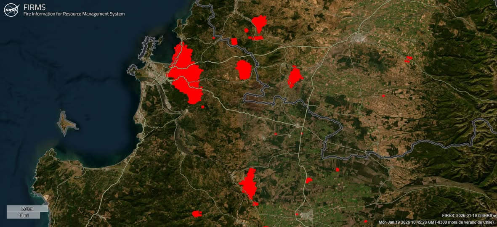

:::{.figure-caption style="margin-top: -2rem;"}
Fuente: Noticias Uchile. https://uchile.cl/noticias/236805/estudio-de-2020-uchile-alerto-sobre-riesgo-de-incendios-en-penco-y-lirquen
:::

**¿Me puedes contar brevemente el estudio? (2020, sobre los riesgos de incendio)**

Bueno, el año 2020, a propósito de un número especial de la revista de ciencia del CBIEN, nosotros escribimos un artículo sobre la interfaz urbano-forestal. En Chile no existe una planificación territorial que incorpore el ámbito rural y estábamos viendo grandes incendios, como los del año 2017, que motivó parte de este estudio. Entonces pensamos que había un área que debía ser normada, regulada y que en otros países de climas mediterráneos como el nuestro ya estaba regulada, como en España, Portugal, Italia. Y a partir de esa inquietud, de la mayor incidencia de los incendios en Chile, es que tratamos de plasmar un área a planificar que corresponde justamente a la interfaz urbano-forestal. Eso es un poco lo que motivó ese estudio y que lo que finalmente hace es interceptar la población urbana con el material combustible de bosque, plantación, espacios, sal, matorrales, todo aquello, en un área donde convergen y esa área donde convergen se define como un área a intervenir, a despejar de vegetación boscosa y de plantaciones y tratar de planificarla con plantas bajas, justamente frenar el avance del fuego hacia la ciudad.

**¿Qué advertencia se hizo en el estudio y sugerencias a las políticas públicas?**

Efectivamente, nuestros cálculos indicaban en ese minuto que había más de 3 millones de personas expuestas a incendios forestales entre Valparaíso y la Araucanía, que es un poco la región que marcamos acá como mediterránea. Y esa población que iba a estar expuesta, en gran parte, corresponde a esa intersección que muestra. Y en número de habitantes, la región de Bío Bío era la más comprometida, con más de 800.000 personas. Y Penco era una de las comunas que iba a tener mayor incidencia.

En Chile tenemos una mala planificación territorial. Partimos de la idea de que lo único que tenemos, que regula el uso de suelo de manera ordenada, coherente, definiendo uso, es la planificación urbana, a través de los planos reguladores comunales, intercomunales y seccionales. Pero el área rural no está regulada. Por eso hoy día tenemos proliferación de parceladas de grado, tenemos contaminación en los lagos, como he dicho Ken, producto de estas parcelaciones. Pero el área rural no está regulada. Por eso hoy día tenemos proliferación de parceladas de grado, tenemos contaminación en los lagos, como he dicho Ken, producto de estas parcelaciones. Tenemos gente viviendo en bosques en Coyhaique, en Aysén, en el lago Ranco, en distintos sitios, y que están totalmente expuestos a los incendios forestales en su gran mayoría. O incluso pueden generar los incendios, es que no tienen los cuidados debidos. Entonces, un poco nos preocupa justamente que se regule el ámbito rural. Uno, porque… No puede ser que la gente viva pegada al bosque. Eso los pone inmediatamente en riesgo. Dos, producto del cambio climático, las condiciones van a ser más extremas. Entonces podrían estar expuestos a inundaciones y otras amenazas, más allá de los incendios. Y tres, porque sabiendo las tendencias del clima, seguramente hay que hacer una reorganización de los usos del suelo rural. Seguramente hay que hacer una reorganización de los usos del suelo rural. Por ejemplo, los viñedos se van a trasladar al sur, quizás. Quizás hay que adelantar un poco eso. Las plantaciones ya no están adaptadas al clima actual. No porque no sean productivas, sino porque llega un tiempo de estrés hídrico en el verano que los hace propicios para que se incendien. Es más inflamable hoy día las plantaciones forestales. Entonces, tenemos un problema…

**Urge entonces una planificación territorial en nuestra región y en Chile.**

Exacto. Y la ley de prevención de incendios, que todavía no ha tenido la prioridad suficiente, menciona esto de la interfaz urbano-forestal y menciona áreas de amortiguación. Entonces, de todas maneras, se está avanzando, pero esos avances no son suficientes si es que no se considera todo el territorio hacia la planificación normal.

**¿Cuál es el aporte que puede hacer la academia desde la investigación a fenómenos de desastres socionaturales?**

Sí, es importante investigar porque, en este caso, es evidencia científica al servicio de políticas públicas. O sea, efectivamente, no toda la ciencia se dedica a esa interfaz ciencia-política, pero en este caso sí es político, porque tiene que ver con proponer evidencias al Senado, a los ministerios, a los municipios, es decir, estas zonas están en peligro, deben actuar sobre ellas y por lo tanto debemos robustecer nuestras normativas, nuestras normativas legales y nuestras regulaciones para proteger a las personas. Nuestro principal interés es que la gente habite territorio seguro y para ello el Estado debe robustecer la gobernanza y las normas aplicadas al territorio.

Hoy día hay una necesidad de investigación ligada al cambio climático, ligado a los riesgos de desastre, ligado a las inequidades territoriales y por lo tanto la idea es motivar a jóvenes a que sigan profundizando estos estudios a través de sus carreras de Sociología, Geografía, Arquitectura, Diseño, Antropología, tantas disciplinas que aportan a mejorar nuestro país e ir profundizando con estudios de Magistra y Doctorado. O sea, la invitación es a tratar de generar evidencias científicas para una sociedad más justa, más segura y más equitativa.

Hay tanto plantaciones forestales activas como también tierras que han sido en parte abandonadas. O sea, no eran solamente las plantaciones, además se reconoció a partir de la CORMA, la Corporación de Madera, que había muchos residuos forestales en ese lugar y eso ayudó también a colocar material combustible. Pero, por ejemplo, Punta de Parra o Florida están totalmente expuestas. Acá también han habido incendios importantes. Y Hualqui también salió nombrado como una zona peligrosa.

Hay responsabilidad. Hay responsabilidad compartida. Sí, porque efectivamente, si hubiera normativa de planificación, ellos debieran generar acá zonas con otros usos diferentes de plantaciones abandonadas o plantaciones activas. Porque, claro, se incrustan al interior de la ciudad y eso hace que se propague el fuego. O sea, este es el área que nosotros habíamos dicho que... Había que despejar, ¿cierto? Para evitar esa cercanía con Entonces, lo último, aprovechar. O sea, en el fondo tú dices, hay una falta de regulación, de planificación y eso permite un laissez-faire, digamos, ¿o no?

Donde nada está normado y lo que tú dices, como que se incrusta el tema de los cultivos en los poblados. Y, de hecho, los encierra. Los encierra, sí. Es peor todavía. O sea, la ley de prevención de incendios justamente está diciendo definir un área de interfaz que va a tener un uso de suelo de plantas bajas, parques, plazas. Imagínate todo el borde de Penco que en vez de espacios inseguros que son estas plantaciones, porque se pueden incendiar, tuviese una serie de parques de ladera, por ejemplo, conectando todo el lugar para hacer senderismo y distintas actividades con parques como el que se estaba proponiendo para Penco, sería mucho mejor. Porque hoy día ellos tienen una amenaza y no tienen un espacio de, digamos, de espacio público para el disfrute, ¿cierto? Y la contemplación de la naturaleza o, en este caso, los árboles. Pero en cualquier caso, si esa zona tuviese, se transformarán en parques, se transformarán en cultivos, se transformarán en áreas productivas, por ejemplo, con viñedos, etcétera. O sea, con todo, hortalizas y otros usos, sería mucho mejor. Y esto es una situación que se da en distintas partes del país, ¿no?

Mira, el mapa, que me está ajustando al contrario (...) Suelos quemados…Esto fue lo que nosotros le mandamos, ¿cierto? Ya tiene más de 300 visualizaciones, pero no está… Entonces, estas son todas las áreas del mapa del año 2020, ¿no? Entonces, si te fijas, por ejemplo, Cabrero. Cabrero. Toda esa área está definida como interfaz. Toda esa área está definida como interfaz. Si nos vamos a Florida, que es un sitio que estuvo hoy día amenazado, Florida solamente se salva esa zona en la lógica de… En caso de un incendio.

Si tú te acercas, estos árboles conectan con las casas y estas casas se empiezan a quemar y estas calles no son suficientemente grandes para frenar la flama. Esta cercanía de acá también es muy grande. Estas son plantaciones. Se nota que son plantaciones por la disposición ordenada de los árboles. ¿Te fijas que están ordenados? Son verdaderas… Por eso se llaman plantaciones, porque están todo ordenado y densamente constituido. Entonces, fíjate la cercanía que hay ahí. Toda esa zona dijimos que iba a ser afectada por los incendios. Porque está el bosque… proponemos, es que no exista esta lógica de las casas y estas plantaciones, que en este caso parecen abandonadas. Claro, pero el tema de fondo es la regulación.

Es mi responsabilidad \[se refiere a las empresas forestales\]. Si yo soy dueño de una tierra, soy propietario, yo soy responsable de cómo ese territorio genera peligro a otras personas. Ellos son culpables porque finalmente ellos no están despejando, han dejado tierras abandonadas y eso pone en peligro a personas. Ya sabemos, han muerto más de 20 personas y se han quemado miles de casas, entonces hay responsabilidades.

La idea acá \[en las plantaciones forestales\] es cosechar de muro a muro… claro, uno de los grandes problemas de los usos de suelo en los ámbitos forestales es que no hay espacios de descanso ni mixtura de uso de suelo lo que tenemos es una continuidad forestal que nosotros llamamos de muro a muro. No hay deslinde a deslinde, no hay nada que frene el avance de las llamas, se puede generar un incendio en algún lugar, pero si uno tiene no cortafuegos, sino que áreas despejadas de vegetación de mil metros de cuatrocientos metros o al menos las partes de las cabeceras de las cuencas libres, eso puede frenar el avance de las llamas, y eso permite justamente, por ejemplo, que el combate del incendio sea mucho más efectivo. Imaginemos grandes corredores en el terreno, de gran magnitud, podría permitir que los helicópteros pudieran volar por esa área despejada y apagar las llamas también ayudaría el combate. Lo que hoy día tenemos es la complejidad que incluso cuando van los aviones de combate, con esta topografía y esta continuidad, no se puede meter al lugar porque están metidos en una convección… genera turbulencia y una serie de problemas, se genera un clima propio de los incendios, y por lo tanto no pueden atacarlo de manera efectiva. Entonces, si tenemos áreas despejadas, o por qué no decirlo, con otros usos de suelo como los cultivos, plantas bajas… Y aún así siendo productivo. Nuestra invitación no es hacer que el territorio sea improductivo, pero no puede ser solamente un uso.